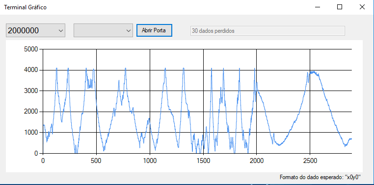

# Terminal Serial Gráfico
Terminal Serial para visualização de dados analógicos em C++. Este é um terminal com algumas funções reduzidas, apenas para facilitar a configuração dos parâmetros. Ele foi criado usando a IDE da microsoft Visual Studio 2017 em c++.

## Tela do Terminal

Apenas duas configurações são necessárias, o baud rate e a porta de conexão. Ao lado são exbidibos a quantidade de dados perdidos. Isso corresponde à chegada de um dado fora da sequência dos dados de saída. Nos testes feitos na velocidade máxima de 2MBps e uma taxa de amostragem de 40ms existem uma quantidade 1 dado a cada 100 amostras. Ao aumentar a taxa de amostragem, o terminal fecha, sendo impossível nesta versão chegarmos a uma resolução desejada de 50us.
O frame deve vir no formato "x??y??", onde "??" é uma valor munérico sem quantidade de casas específicas. Não é necessário enviar retorno de linha ao final do frame, para evitar o desperdício de tempo.

### Ainda é preciso implementar:
* Botão de reset para limpar os dados;
* Botão para exportar os dados para o formato .csv;
* Campo para variável de escala do eixo y;
